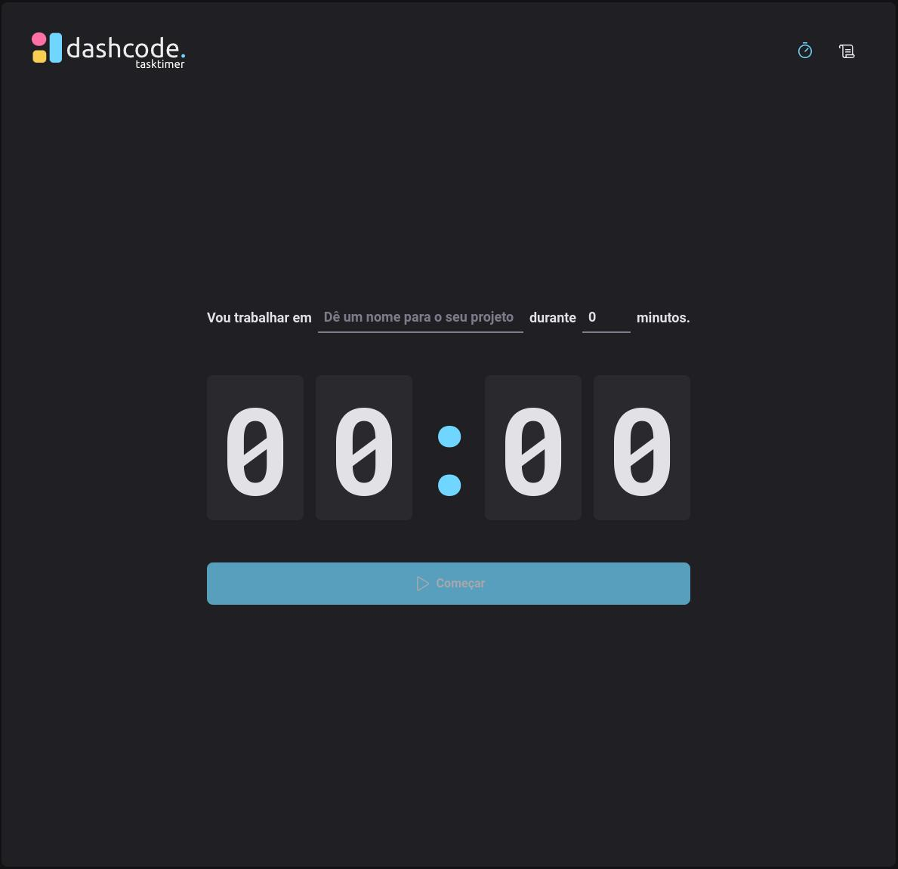
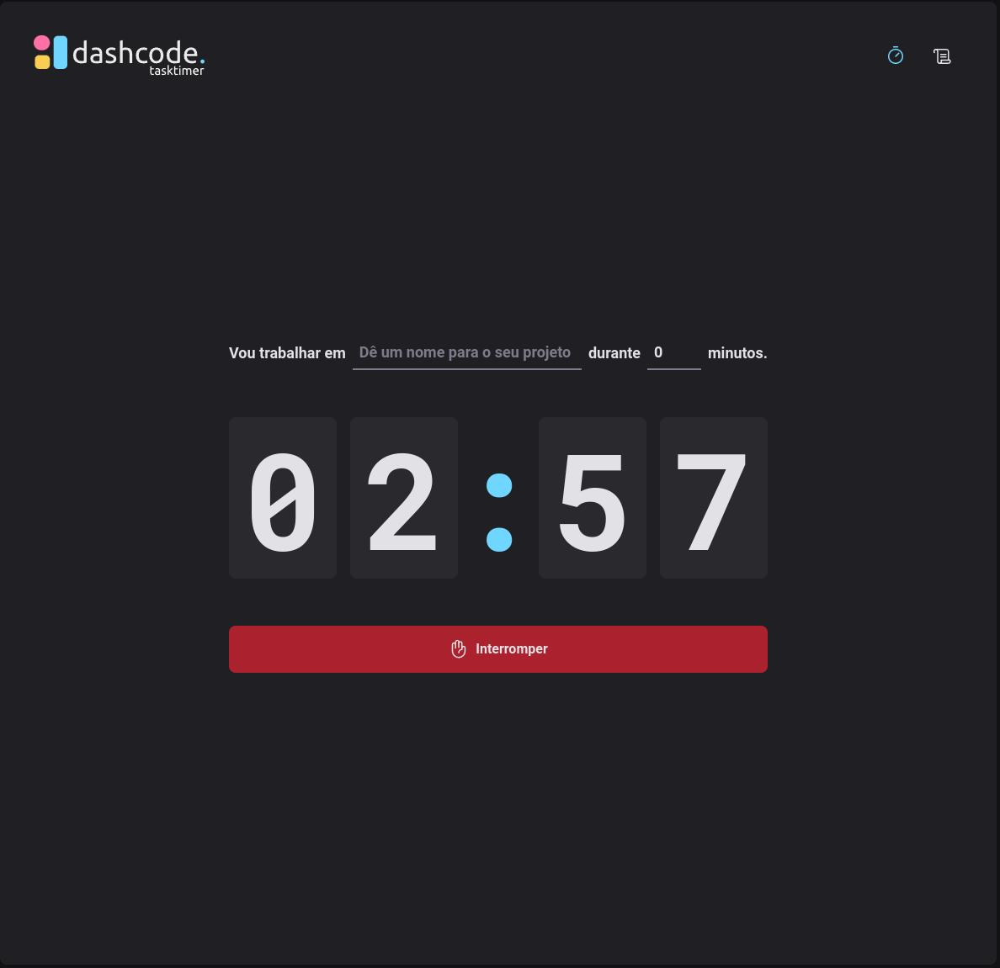
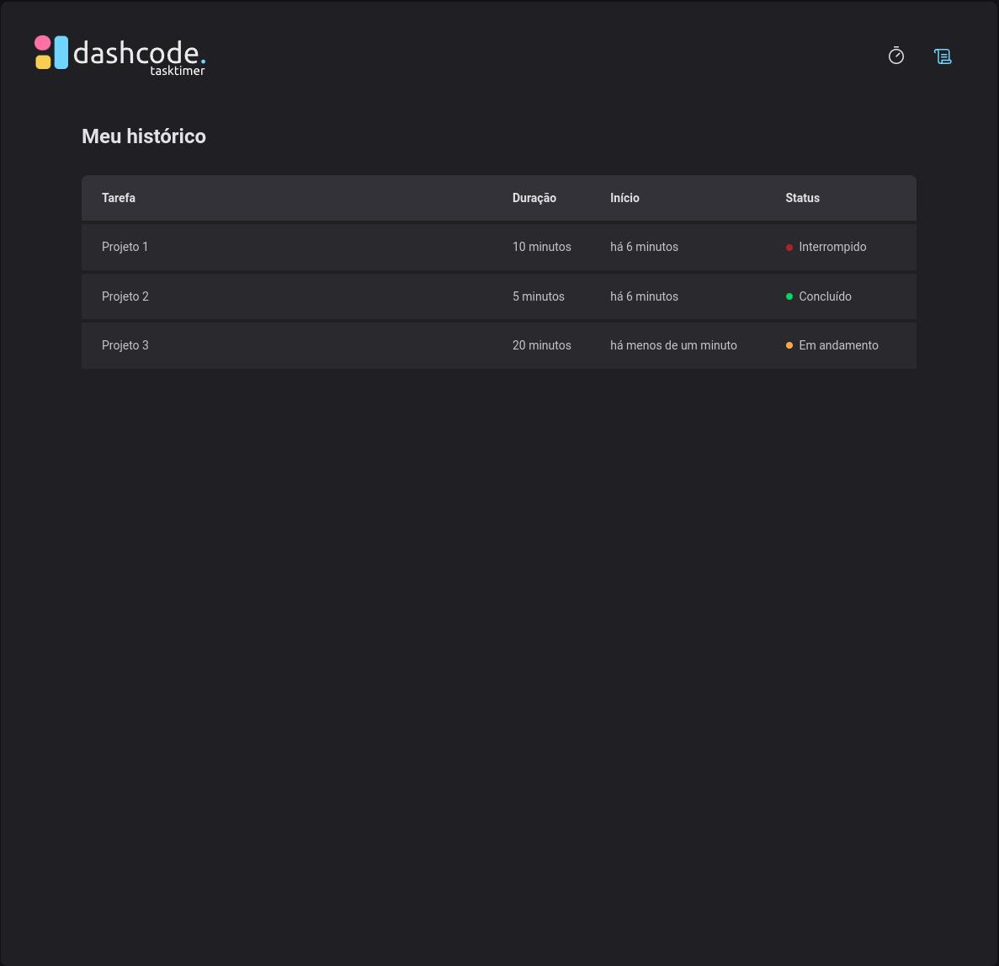

 

## 📄 Descrição

Projeto desenvolvido no módulo Ignite 2022 da Rocketseat 🚀.
Projeto de plataforma de e-learning feito com ReactJS, Context API, Vite JS, Styled Components, Immer JS

## 🌎 Versão Ao Vivo

## 🛠 Technologies

![react][react] ![context api][reactcontext] ![vite][vite] ![styled components][styledcomponents] ![immer js][immer]

## 📷 Screenshots

## 🦾 Sobre mim

[react]: https://img.shields.io/badge/react-1E4174?style=for-the-badge&logo=react&logoColor=white&labelColor=81D8F7

[reactcontext]: https://img.shields.io/badge/react%20context%20api-1E4174?style=for-the-badge&logo=react&logoColor=FFFFFF&labelColor=FF4A8F

[vite]: https://img.shields.io/badge/vite-1E4174?style=for-the-badge&logo=vite&logoColor=white&labelColor=FFD028

[styledcomponents]: https://img.shields.io/badge/styled%20components-1E4174?style=for-the-badge&logo=styledcomponents&logoColor=white&labelColor=FF70A6

[immer]: https://img.shields.io/badge/immer-1E4174?style=for-the-badge&logo=immer&logoColor=00E7C3&labelColor=2C2C2C

