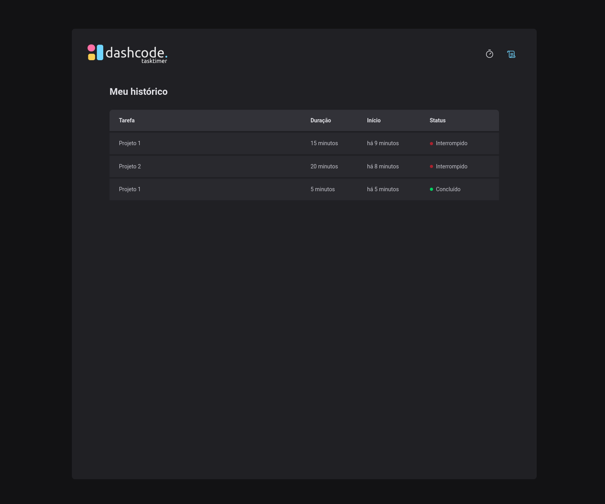

 

## 📄 Descrição

Projeto desenvolvido com intuito de criar uma aplicação de controle de tempo de tarefas (task timer), feito com ReactJS, ViteJs, ChakraUI, StyledComponents, React Hook Form e ImmerJS

## 🌎 Versão Ao Vivo

## 🛠 Technologies

![react][react] ![vite][vite] ![styled components][styled] ![react hook form][reacthookform] ![immer][immer] 

## 📷 Screenshots

## 🦾 Sobre mim

[react]: https://img.shields.io/badge/react%20js-1E4174?style=for-the-badge&logo=react&logoColor=white&labelColor=81D8F7

[vite]: https://img.shields.io/badge/vite%20js-1E4174?style=for-the-badge&logo=vite&logoColor=white&labelColor=FFD028

[styled]: https://img.shields.io/badge/styled%20components-1E4174?style=for-the-badge&logo=styledcomponents&logoColor=white&labelColor=B83280

[reacthookform]: https://img.shields.io/badge/react%20hook%20form-1E4174?style=for-the-badge&logo=reacthookform&logoColor=white&labelColor=EC5990

[immer]: https://img.shields.io/badge/immer%20js-1E4174?style=for-the-badge&logo=immer&logoColor=00E7C3&labelColor=white
